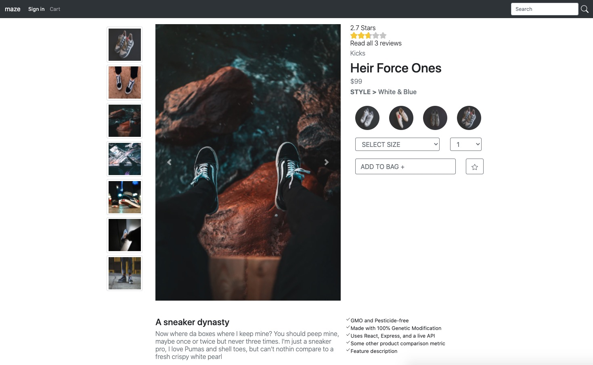
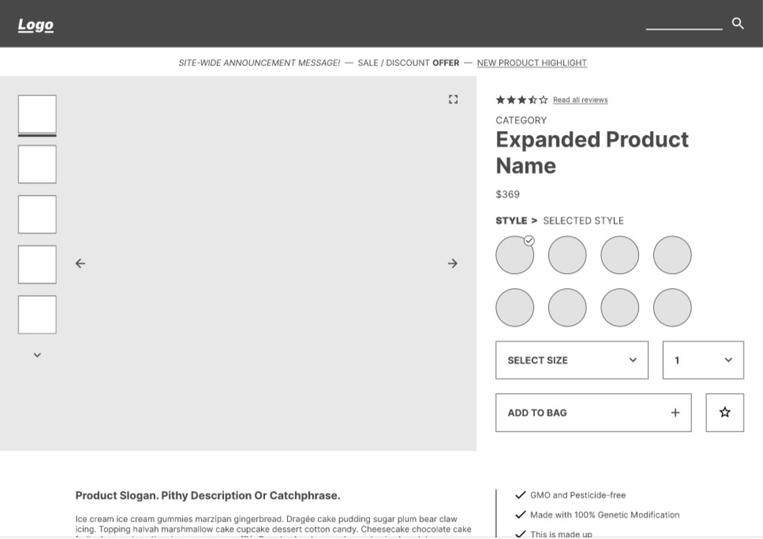

# Maze Mercantile
> About
Maze Mercantile is an e-commerce site specializing in urban apparel with a focus on an appealing presentation and intuitive user interaction / experience. This repo highlights my abilities in Front-end development.


The app provides ...

## My Contribution to this Project


## Related Projects
- https://github.com/Maze-Merch/maze-proxy-server
- https://github.com/Maze-Merch/related-products
- https://github.com/Maze-Merch/reviewsService
- https://github.com/Maze-Merch/reviewsService



## Getting Started
Prerequisites: NodeJS and Xcode

Clone the Github repository:
```
$ git clone https://github.com/Maze-Merch/productDetails.git
```

cd into the directory 'productDetails' and run the following commands:

```
$ npm install
$ npm start
```
Now, navigate to http://localhost:3001 in your browser

# Business Requirements Image



## Built With
* React
* Node.js
* Express
* Bootstrap
* HTML5
* CSS3
* JavaScript


# proxy-server
To run all 4 services, RUN: npm start --> this script runs: npm run concurrently and nodemon to cd into each service and run the 'start' script within that service. If this command fails anywhere, it will kill all the other commands in this script.

To efficiently update all services to their current master branch version, RUN: npm run updateAll --> this script will run 4 scripts within the proxy server called updateServiceOne, updateServiceTwo, updateServiceThree, and updateServiceFour. Each of these scripts will cd into 1 of the 4 services and RUN: git checkout && git pull --> these scripts will checkout the master branch of the service and pull the most recent commit.

To turn off the servers for all 4 services, ENTER: control+c --> for a mac

All css files have been combined on the proxy server under the dist folder inside the styles.css file.

the index.html for the proxy server exists in the dist folder of the proxy server. In the body of this file is a div for each of the 4 services which line up with what each service is expecting in their ReactDOM.render. Also, in this file exists the header and footer attributes.

# product-details
To run this service, RUN: npm start --> this script runs: npm run concurrently to RUN: npm run build as well as: nodemon server/index.js --> the build script runs: npm run webpack --watch --mode development.

To run tests, RUN: npm run test --> this script will tuns: jest

To run esLint, RUN: npm run lint --> this script runs: ./node_modules/.bin/eslint
